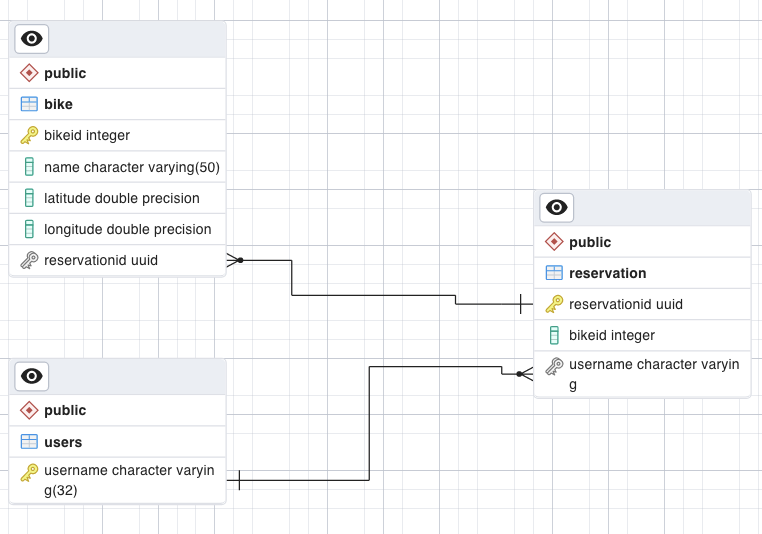

# eBikeAPI

## What is this project about?
This project is a backend implementation of an eBike renting system in golang.

## Endpoints / OpenAPI Doc
This backend provides endpoints to...
- retrieve all bikes in the system
- get all reserved bikes from a user
- create a bike reservation
- delete a bike reservation

To see the full specifiation of the API, checkout the project and visit [editor.swagger.io](https://editor.swagger.io/) in a browser, click on "File" -> Import file and choose the **OpenApi_doc.yaml**.
On the right side of the page you can now see the full API specification of the backend.

## TechStack
To run the backend you need the following:

- system with golang 1.19.6
- PostgreSQL version 15.2
- VSCode as editor

## Database ERD Diagram



There are 3 Tables in the database

- bike
- reservation
- users

The **bike** table stores all bikes available in the system. It has following columns
* **bikeId (int):** Primary key. Used to identify a bike
* **name (character varying (50)):** Every bike has a name which is represented as string
* **latitude (double precision):** The latitude of the bike
* **longitude (double precision):** The longitude of the bike
* **reservationid (uuid):** The reservationid is a foreign key to the primary key 'reservationid' of the reservation table. The type is uuid and it is nullable. If a bike has a reservationid set to an uuid, it means that it is reserved and not available for rent. It is set to "Set NULL ON DELETE", which means if the corresponding record in the reservation table is deleted, it is automatically set NULL.

The **reservation** table stores all bikes available in the system. It has following columns
* **reservationid (uuid):** The reservationid is the primary key and is from the type uuid.
* **bikeId (int):** Used to identify the reserved bike.
* **username (character varying (32)):** The user who reserved the bike. The username is a foreign key to the primary key 'username' of the users table. It is set to "ON DELETE CASCADE", which means if the corresponding record in the user table is deleted, the corresponding reservation record is also deleted.

The **username** table stores all usernames. It has following columns:
* **username (character varying (32)):** The username of the user.
Hint: You can also add name, surname, address etc to this table. The plan was to use keycloak as identity provider and store the details of the user in the keycloak database and setup a synchronization between the database of keycloak and the user table.

# Installation

## Golang (1.19.6)
* Go to the [golang-website](https://go.dev/doc/install), download the installer for your operation system
* follow the installation instructions for your operating system
* To verify installation type in terminal (Linux/macOS)
```
go version
```
The result should be:
```
go version go1.19.6 darwin/amd64
```
* open the project with VSCode and install all recommended Golang extentions

## PostgreSQL (15.2)
* Go to the [official PostgresSQL website](https://www.postgresql.org/download/), download the installer for your operation system. The package you download should include the **psql shell** because we need it later.
* follow the installation instructions for your operating system to install PostgreSQL. In this project, **port 5432** is used.
* open a **psql shell**, change the directory to the root of this project and type

```
\i eBikeDbInitScript.sql
```

This command executes the init script and creates the tables (and their configurations) with some sample data. The basic database "postgres" is used.
* To verify if the tables are created, use pgadmin 4 or tools like DBEAVER.

# Run the API
* make sure your postgreSQL server is started
* open the project with VSCode
* Start the development Server Debugger by running the run configuration.
* The server runs on **port 8080**
* The database runs on **port 5432** (standard postgres port)

# Postman Collection
You can send requests to the backend without the UI application by using Postman. There is a postman collection in the root of the project which you can import.